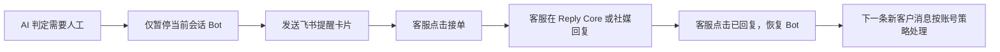
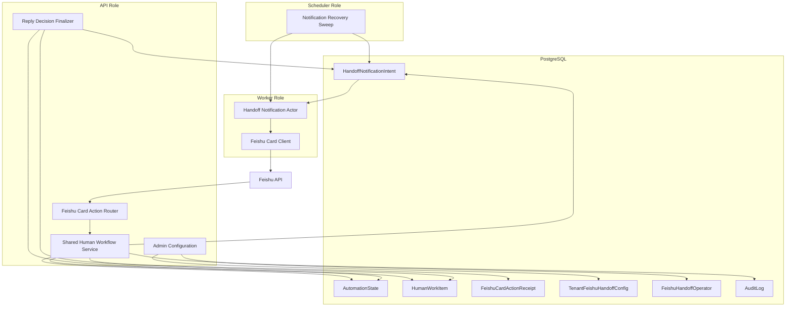
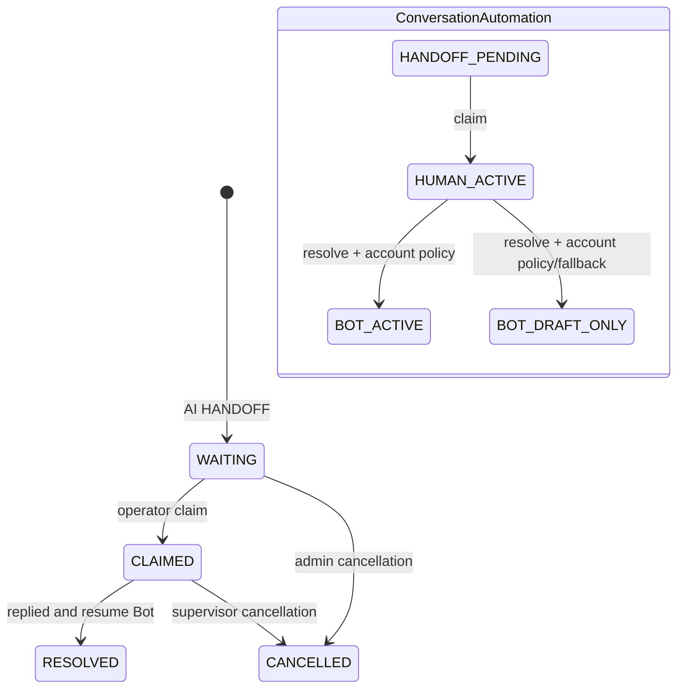
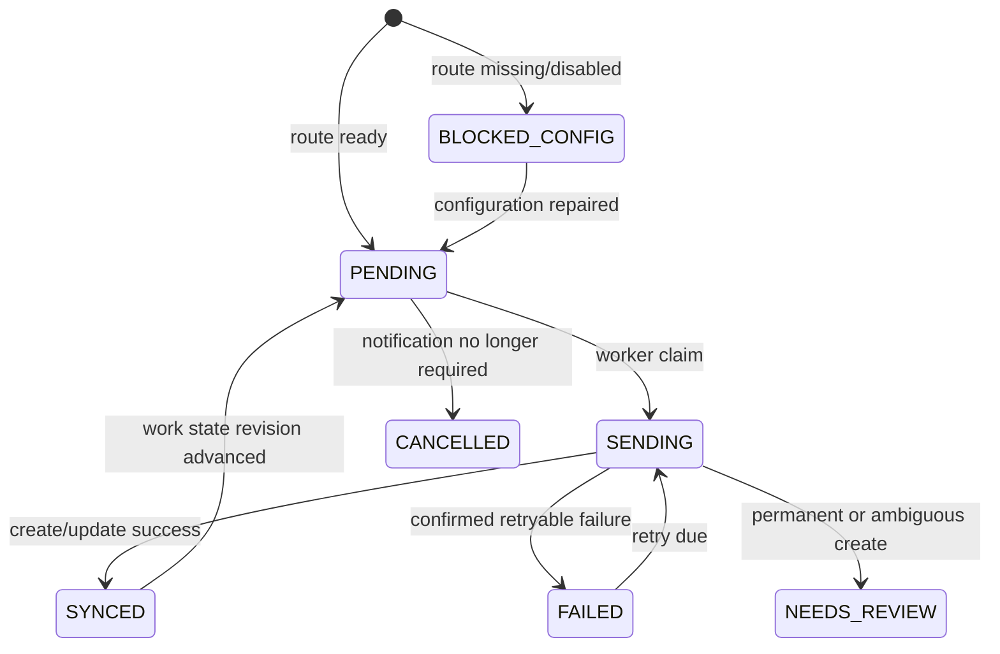

# 飞书人工接管通知与 Bot 恢复实施方案

> 状态：实施提案，尚未实现  
> 目标分支：`dev`  
> 适用架构：FastAPI 模块化单体、PostgreSQL、Dramatiq/Redis、API/Worker/Scheduler 单镜像多角色  
> 核心原则：PostgreSQL 是唯一 durable truth；Redis 只用于瞬时唤醒和队列传输

## 1. 目标

实现以下闭环：



业务语义：

1. AI 产生 `HANDOFF` 后，只暂停对应 Conversation，不影响同一账号的其他会话。
2. `PlatformAccount.automation_default` 仍然是账号级自动化策略。
3. `HumanWorkItem` 是会话级人工工作状态。
4. `AutomationState` 继续作为当前兼容层和发送权威。
5. 客服解决工单后，Conversation 恢复到账号当前的 `automation_default`。
6. 人工接管期间收到的消息保持持久化，但不补答、不重放。
7. 只有解决之后新进入的下一条客户消息才重新进入 Bot 决策流程。

## 2. 当前能力与缺口

### 2.1 已有能力

当前系统已经实现：

- AI、规则和 Final Guard 可以产生 `HANDOFF`。
- HANDOFF 会把 Conversation 切换为 `HANDOFF_PENDING`。
- HANDOFF 会创建唯一开放的 `HumanWorkItem(status=WAITING)`。
- 接单会把工作项切换为 `CLAIMED`，并把 Conversation 切换为 `HUMAN_ACTIVE`。
- 接单会取消该 Conversation 尚未发送的 Bot Decision Outbox。
- 解决工作项会恢复账号当前的 `automation_default`。
- 本地 Admin Inbox 支持接单、人工回复和解决。
- Feishu 已支持企业自建应用、签名/AES 校验、消息事件接收和文本回复。
- Worker 和 Scheduler 已有 PostgreSQL-backed Outbox、lease、重试和恢复模式。

### 2.2 缺失能力

当前系统尚未实现：

- HANDOFF 事务中创建飞书通知 intent。
- Tenant 到“通知 Feishu 账号 + 客服群”的路由配置。
- Feishu interactive card 创建和更新。
- Feishu card action callback。
- Feishu operator 授权和身份映射。
- 卡片 action 的 nonce、版本、幂等和并发控制。
- 通知发送失败、歧义发送和卡片更新失败的 durable recovery。
- 外部社媒回复的结构化人工确认和审计证据。

## 3. 架构决策

### 3.1 推荐方案

新增独立的 PostgreSQL `HandoffNotificationIntent`，将飞书卡片视为 `HumanWorkItem` 的异步 UI 投影。

业务真相保持为：

```text
HumanWorkItem + AutomationState + PlatformAccount.automation_default
```

飞书卡片只负责：

```text
展示当前工作状态 + 触发已有 claim/resolve 业务操作
```

### 3.2 不复用客户消息 Outbox

现有 `OutboxMessage` 不适合承载飞书客服提醒，原因包括：

- 必须绑定客户 Conversation。
- 必须绑定 Conversation 原平台账号。
- direct delivery 必须绑定客户 inbound `reply_to_message_id`。
- destination contract 是客户回复目标，不是运营通知目标。
- send-time validation 要求账号、Conversation、Contact 和 reply target 一致。

典型通知是：

```text
X / Facebook / Instagram / Telegram / WhatsApp Conversation
    -> 另一个 Feishu PlatformAccount
    -> Tenant 客服群 chat_id
```

因此不能通过放宽现有 Outbox 隔离约束来实现。

### 3.3 明确拒绝的替代方案

本方案不采用：

- 在 HANDOFF 数据库事务内同步调用飞书 API。
- 使用 Redis 保存通知状态或工单状态。
- 使用飞书自定义群机器人 webhook。
- 默认把客服群所有成员视为授权 operator。
- 为通知新增 Kafka、Celery、微服务或第二套镜像。
- 暂停整个 PlatformAccount 的所有 Conversation。
- resolve 后补答人工期间的历史消息。
- 根据不完整的社媒 echo 自动判断客服已经回复。
- 复制一套新的 claim/resolve 状态机给飞书卡片使用。

## 4. 目标组件架构



职责边界：

| 模块 | 职责 |
|---|---|
| Reply Decision | 创建 HANDOFF、暂停当前会话、创建工作项和通知 intent |
| Human Workflow | claim/resolve 的唯一业务实现 |
| Handoff Notification | 卡片渲染、intent 状态和发送恢复 |
| Feishu Connector | Provider HTTP、签名、解密、callback contract |
| Admin Control Plane | Tenant 通知配置和 operator 授权 |
| Worker | 发送或更新卡片 |
| Scheduler | 恢复遗漏、失败和 lease 过期任务 |

## 5. 数据模型

所有 schema 变更必须通过新的 additive Alembic migration 实现，不修改已经发布的 migration。

### 5.1 `tenant_feishu_handoff_configs`

每个 Tenant 第一版只允许一个有效通知路由。

建议字段：

```text
id                              UUID PK
tenant_id                       TEXT UNIQUE NOT NULL
feishu_platform_account_id      UUID NOT NULL
destination_chat_id             TEXT NOT NULL
enabled                         BOOLEAN NOT NULL DEFAULT false
config_version                  INTEGER NOT NULL DEFAULT 1
card_locale                     TEXT NOT NULL DEFAULT 'zh_cn'
created_at                      TIMESTAMPTZ NOT NULL
updated_at                      TIMESTAMPTZ NOT NULL
```

约束：

- Feishu PlatformAccount 必须属于同一 Tenant。
- `platform` 必须为 `feishu`。
- 账号必须 active，发送时健康状态必须为 `READY`。
- 配置更新必须递增 `config_version` 并写 AuditLog。

### 5.2 `feishu_handoff_operators`

显式授权哪些 Feishu 用户可以操作工单。

建议字段：

```text
id                              UUID PK
tenant_id                       TEXT NOT NULL
feishu_platform_account_id      UUID NOT NULL
operator_open_id                TEXT NOT NULL
display_name                    TEXT NULL
admin_user_id                   UUID NULL
can_claim                       BOOLEAN NOT NULL DEFAULT true
can_resolve                     BOOLEAN NOT NULL DEFAULT true
status                          TEXT NOT NULL
created_at                      TIMESTAMPTZ NOT NULL
updated_at                      TIMESTAMPTZ NOT NULL
```

约束：

- 唯一键：`(feishu_platform_account_id, operator_open_id)`。
- `status` 只允许 `ACTIVE` 或 `DISABLED`。
- `open_id` 是应用范围身份；更换 Feishu 应用后必须重新授权。
- 不把群成员身份自动转换为业务权限。

Actor 建议使用稳定值：

```text
feishu_operator:<operator_record_id>
```

如果 operator 已关联 AdminUser，可以使用统一的用户 actor，保证网页和飞书操作拥有一致归属。

### 5.3 `handoff_notification_intents`

每个 HumanWorkItem 对应一张逻辑卡片。

建议字段：

```text
id                              UUID PK
public_id                       UUID UNIQUE NOT NULL
tenant_id                       TEXT NOT NULL
human_work_item_id              UUID UNIQUE NOT NULL
conversation_id                 UUID NOT NULL
notification_config_id          UUID NULL
config_version                  INTEGER NULL
feishu_platform_account_id      UUID NULL
destination_chat_id             TEXT NULL
provider_uuid                   UUID UNIQUE NOT NULL
provider_message_id             TEXT NULL
status                          TEXT NOT NULL
desired_card_state              TEXT NOT NULL
desired_revision               INTEGER NOT NULL DEFAULT 1
delivered_revision             INTEGER NOT NULL DEFAULT 0
action_nonce                    UUID NOT NULL
sending_revision                INTEGER NULL
attempt_count                   INTEGER NOT NULL DEFAULT 0
next_attempt_at                 TIMESTAMPTZ NULL
claim_token                     UUID NULL
claim_expires_at                TIMESTAMPTZ NULL
last_error_code                 TEXT NULL
last_error_message              TEXT NULL
valid_until                     TIMESTAMPTZ NULL
created_at                      TIMESTAMPTZ NOT NULL
updated_at                      TIMESTAMPTZ NOT NULL
synced_at                       TIMESTAMPTZ NULL
```

状态词表：

```text
BLOCKED_CONFIG
PENDING
SENDING
SYNCED
FAILED
NEEDS_REVIEW
CANCELLED
```

卡片业务状态：

```text
WAITING
CLAIMED
RESOLVED
CANCELLED
```

关键约束：

- `human_work_item_id` 唯一，防止重复 HANDOFF 产生多张逻辑卡片。
- `delivered_revision <= desired_revision`。
- `SENDING` 必须有 `claim_token` 和 `claim_expires_at`。
- Provider `message_id` 只能在成功创建卡片后写入。
- action nonce 在每次工作状态变化时旋转。

### 5.4 `feishu_card_action_receipts`

用于 provider callback 去重和稳定响应。

建议字段：

```text
id                              UUID PK
feishu_platform_account_id      UUID NOT NULL
provider_event_id               TEXT NOT NULL
notification_intent_id          UUID NULL
operator_open_id                TEXT NULL
action                          TEXT NULL
request_digest                  TEXT NOT NULL
outcome                         TEXT NOT NULL
response_payload                JSONB NOT NULL
created_at                      TIMESTAMPTZ NOT NULL
completed_at                    TIMESTAMPTZ NULL
```

约束：

- 唯一键：`(feishu_platform_account_id, provider_event_id)`。
- 不保存 Verification Token、Encrypt Key、完整原始 payload 或客户完整消息。
- Provider 重试相同 callback 时返回已保存的相同业务响应。

### 5.5 `human_work_items` 扩展

建议增加 nullable 字段，兼容旧版本：

```text
resolved_actor                  TEXT NULL
resolution_evidence             TEXT NULL
resolution_outbox_id            UUID NULL
```

`resolution_evidence` 建议取值：

```text
REPLY_CORE_CONFIRMED
FEISHU_OPERATOR_ATTESTED
ADMIN_OPERATOR_ATTESTED
SUPERVISOR_OVERRIDE
```

## 6. 状态机

### 6.1 业务状态机



### 6.2 通知状态机



## 7. 事务边界

### 7.1 AI HANDOFF 事务

当前 HANDOFF finalization 已持有 Conversation delivery advisory transaction lock。需要在相同事务中：

```text
1. 锁定 AutomationState。
2. 校验 DecisionJob generation、claim token 和 state version。
3. 将当前 Conversation 切换为 HANDOFF_PENDING。
4. 创建或获取唯一开放 HumanWorkItem。
5. 创建或获取唯一 HandoffNotificationIntent。
6. 保存 ReplyDecision(HANDOFF)。
7. COMMIT。
8. commit 后 best-effort dispatch notification actor。
```

不变量：

- 不修改账号级 `automation_default`。
- 不影响同一账号其他 Conversation。
- 飞书配置错误不能回滚 HANDOFF。
- 事务提交前不得访问 Feishu API。
- broker dispatch 丢失后 Scheduler 必须能够从 PostgreSQL 恢复。

配置处理：

- 配置有效：intent 为 `PENDING`。
- 配置缺失或 disabled：intent 为 `BLOCKED_CONFIG`。
- 不因为没有飞书通知而阻止本地 Admin Inbox 展示工单。

### 7.2 接单事务

Admin 和 Feishu callback 必须调用同一个 session 内 claim 服务。

建议锁顺序：

```text
1. Conversation advisory transaction lock
2. Conversation FOR UPDATE
3. 客户侧 PlatformAccount FOR UPDATE
4. HumanWorkItem FOR UPDATE
5. AutomationState FOR UPDATE
6. HandoffNotificationIntent FOR UPDATE
7. Notification config/operator/account validation
```

事务内容：

```text
1. 验证 HumanWorkItem.status == WAITING。
2. 验证 expected work version。
3. 验证 Conversation 仍处于 HANDOFF_PENDING/HUMAN_ACTIVE 兼容状态。
4. HumanWorkItem -> CLAIMED。
5. AutomationState -> HUMAN_ACTIVE。
6. 记录 assigned actor、assigned user、claimed_at。
7. 取消该 Conversation 的 PENDING/FAILED DECISION/BOT Outbox。
8. Notification desired state -> CLAIMED。
9. desired_revision + 1，旋转 action_nonce。
10. 写 state transition、human work、card action AuditLog。
11. 保存 callback receipt。
12. COMMIT。
```

并发规则：

- 第一个持锁且版本匹配的 operator 成功。
- 后续点击返回“已由其他客服接单”，不得返回 500。
- 旧卡片仍可展示，但 action 必须重新读取 PostgreSQL 当前状态。

### 7.3 已回复并恢复 Bot 事务

事务内容：

```text
1. 验证 HumanWorkItem.status == CLAIMED。
2. 验证 expected work version 和 action nonce。
3. 验证当前 operator 就是 assignee。
4. 记录 resolution evidence。
5. HumanWorkItem -> RESOLVED。
6. 读取客户侧 PlatformAccount 当前 automation_default。
7. 应用现有平台安全 fallback。
8. AutomationState -> BOT_ACTIVE 或 BOT_DRAFT_ONLY。
9. 清除 human_agent_id。
10. Notification desired state -> RESOLVED。
11. desired_revision + 1，旋转 action_nonce。
12. 写 AuditLog 和 callback receipt。
13. COMMIT。
```

禁止行为：

- resolve 不创建 DecisionJob。
- resolve 不创建 Bot Outbox。
- resolve 不重放人工期间消息。
- 飞书 operator 不允许 supervisor override。
- resolve 不得把账号策略从 `BOT_DRAFT_ONLY` 自动提升到 `BOT_ACTIVE`。

## 8. 飞书卡片设计

### 8.1 WAITING 卡片

标题：

```text
新的人工接管请求
```

内容：

- 来源平台。
- 平台账号显示名称。
- DM、评论或 mention 类型。
- 客户显示名或脱敏 external ID。
- HANDOFF reason 中文标签和稳定 reason code。
- 最新客户消息的安全摘要。
- 创建时间、已等待时长和 SLA due time。
- “打开 Reply Core 会话”链接。

操作：

- `接单`

### 8.2 CLAIMED 卡片

标题：

```text
已由客服接单
```

内容增加：

- 接单客服。
- 接单时间。
- 当前会话状态 `HUMAN_ACTIVE`。

操作：

- `打开会话`
- `已回复，恢复 Bot`

“已回复，恢复 Bot”必须带确认提示：

```text
Reply Core 无法自动验证外部社媒回复。
继续操作表示你确认已经完成客户回复，并同意恢复该会话的账号自动化策略。
```

### 8.3 RESOLVED 卡片

标题：

```text
已处理
```

内容：

- 解决客服。
- 解决时间。
- resolution evidence。
- 恢复后的策略：自动回复或草稿审核。
- 提示“只有下一条新客户消息会重新进入 Bot 流程”。

不再显示状态变更按钮。

### 8.4 卡片隐私

卡片不得包含：

- 完整历史会话。
- 完整手机号、邮箱或客户账号标识。
- App Secret、Verification Token、Encrypt Key。
- 平台 access token。
- Admin session 或 control API key。
- 任意数据库主键以外的内部敏感结构。

客户消息摘要需要：

- 字符数上限。
- UTF-8 body size 上限。
- 联系方式和敏感内容脱敏。
- 不记录进应用日志。

### 8.5 Action value

卡片 action value 只允许包含：

```text
notification_public_id
action
expected_work_version
expected_card_revision
action_nonce
```

不得包含 Tenant secret、客户消息、账号凭证或 operator 权限信息。

## 9. Feishu Card Action Callback

建议新增独立路由：

```text
POST /webhooks/feishu/{public_id}/card-actions
```

不能将 card action 直接送入当前 `RawEvent -> CanonicalEvent -> DecisionJob` 客户消息链路。

### 9.1 安全校验

回调必须验证：

1. 通过 `public_id` 找到唯一 Feishu PlatformAccount。
2. 请求体不超过限制。
3. 时间戳处于允许窗口。
4. `X-Lark-*` 签名有效。
5. AES 解密成功且 PKCS#7 严格有效。
6. Verification Token 一致。
7. Header App ID 与账号一致。
8. Provider event ID 非空。
9. Operator `open_id` 来自 provider 已验证字段。
10. Operator binding 为 active 且 Tenant 一致。
11. Callback 对应的 notification、work、conversation 和 account Tenant 一致。
12. action、version、revision 和 nonce 一致。

安全失败：

- 返回 401 或 413。
- 不创建 action receipt。
- 不记录原始请求体或 secret。

业务失败：

- 返回 HTTP 200 和安全 toast。
- 不让 Feishu 因业务冲突盲目重试。

示例：

```text
你没有该 Tenant 的接单权限
该工单已由其他客服接单
仅当前接单客服可以恢复 Bot
该卡片已经过期，已显示最新状态
该工单已经完成
```

### 9.2 三秒响应预算

Callback 内禁止：

- 调用 Feishu API。
- 调用社媒 API。
- 调用 Redis 并等待异步处理结果。
- 调用 LLM。
- 等待 Dramatiq actor 完成。

Callback 只执行：

```text
安全校验 -> PostgreSQL 短事务 -> 返回 toast/card JSON
```

目标：

- p95 小于 1 秒。
- 应用级数据库事务预算不超过约 2.5 秒。
- commit 后异步 card update 作为 durable 修复路径。

### 9.3 Callback 幂等

处理顺序：

```text
1. 计算 sanitized request digest。
2. 插入 action receipt。
3. provider event ID 唯一冲突时读取旧 response。
4. 返回完全相同的 response payload。
5. 首次请求才进入 claim/resolve 事务。
```

如果实际 Feishu callback 版本没有稳定 provider event ID，实现前必须先确认官方 contract，并设计经过安全评审的 request identity；不能直接使用时间戳作为幂等键。

## 10. Feishu 卡片发送与更新

Feishu client 建议新增：

```python
create_interactive_card(*, chat_id, card, provider_uuid) -> str
update_interactive_card(*, message_id, card) -> None
```

创建卡片：

- 使用配置的客服群 `chat_id`。
- `msg_type=interactive`。
- 使用 intent 的固定 `provider_uuid`。
- 成功后保存 provider `message_id`。

更新卡片：

- 必须使用已经保存的 provider `message_id`。
- 发送完整、确定性的目标卡片 JSON。
- 不因更新失败静默新建第二张卡片。

## 11. Sender 状态机与恢复

### 11.1 Claim

Worker 使用 PostgreSQL claim：

```text
1. SELECT due intent FOR UPDATE SKIP LOCKED。
2. status -> SENDING。
3. 生成随机 claim_token。
4. 设置 claim_expires_at。
5. attempt_count + 1。
6. 保存 sending_revision = desired_revision。
7. COMMIT。
8. 事务外调用 Feishu API。
```

### 11.2 Finalize

成功后重新锁定 intent，并验证 claim token：

```text
provider_message_id = returned message id
 delivered_revision = sending_revision
```

如果发送期间工作状态已经发生变化：

```text
desired_revision > sending_revision
    -> status = PENDING
```

否则：

```text
status = SYNCED
```

这样可以防止卡片创建期间发生接单或解决导致状态更新丢失。

### 11.3 错误分类

| 错误 | 处理 |
|---|---|
| connect error/connect timeout | `FAILED`，指数退避 |
| HTTP 429/provider rate limit | `FAILED`，指数退避 |
| token 失效 | coalesced refresh 后重试一次 |
| 明确权限/chat ID/参数错误 | `NEEDS_REVIEW` |
| create 的 read timeout/5xx | `NEEDS_REVIEW/AMBIGUOUS_CARD_CREATE`，除非官方确认 UUID 安全去重 |
| update 的暂时错误 | `FAILED`，可安全重试 |
| provider message missing | `NEEDS_REVIEW`，不自动创建新卡 |
| Feishu 账号非 READY | 暂停，不消耗发送尝试 |
| 功能开关关闭 | 保留 durable intent，不发送 |

### 11.4 Scheduler Recovery

Scheduler core lane 新增 notification sweep：

- 派发到期 `PENDING/FAILED`。
- 回收过期 `SENDING` lease。
- 配置补齐后恢复仍有效的 `BLOCKED_CONFIG`。
- Feishu 账号恢复 READY 后重新派发。
- broker dispatch 失败时保留 durable 状态。
- 过期或已取消工单不再发送初始提醒。

## 12. 外部社媒回复证据

### 12.1 推荐模式

客服点击卡片进入 Reply Core 会话，通过现有人工回复 Outbox 发送。

优点：

- 有明确发送 intent。
- 有 DeliveryAttempt。
- 有 provider message ID。
- 有 outbound Message。
- 可以记录 `REPLY_CORE_CONFIRMED`。

### 12.2 外部社媒客户端模式

如果客服直接在 X、Meta、Telegram、WhatsApp 等官方客户端回复，Reply Core 通常无法可靠验证发送结果。

该模式下：

- “已回复，恢复 Bot”是人工确认。
- `resolution_evidence=FEISHU_OPERATOR_ATTESTED`。
- 卡片必须明确提示系统没有自动检测回复。
- AuditLog 记录 operator、时间、work item、conversation 和恢复策略。

禁止：

- 根据下一条客户消息推断客服已回复。
- 根据不完整 webhook echo 自动解决工单。
- 把人工确认描述成系统验证成功。

## 13. Admin 配置面

建议在 `/admin/accounts` 或独立通知配置页面增加：

- Tenant 选择。
- 通知 Feishu PlatformAccount 选择。
- 客服群 `chat_id`。
- 启用/禁用开关。
- 发送测试卡片。
- Operator `open_id` 管理。
- Operator 显示名称。
- 接单权限。
- 解决权限。
- Operator 启用/禁用。
- 最近通知失败和 `NEEDS_REVIEW` 列表。

权限：

- 普通 AdminUser 只能管理自己的 Tenant。
- Bootstrap superadmin 只能管理 `ADMIN_ALLOWED_TENANTS` 范围。
- 通知 Feishu 账号必须属于同一 Tenant。
- 所有配置修改必须写 AuditLog。

配置变化：

- 已经发送的卡片继续使用原 Feishu 账号和 message ID 更新。
- 不把已有卡片静默复制到新群。
- 未发送 intent 可以在明确启用新配置后重新绑定。
- 历史开放工单默认不自动补发，避免通知风暴。

## 14. Feature Flags 与配置

建议新增：

```env
FEISHU_HANDOFF_NOTIFICATIONS_ENABLED=false
FEISHU_HANDOFF_SWEEP_INTERVAL_SECONDS=3
FEISHU_HANDOFF_SENDER_LEASE_SECONDS=30
FEISHU_HANDOFF_MAX_ATTEMPTS=8
```

要求：

- API、Worker、Scheduler 使用同一组值。
- 初次部署必须保持功能关闭。
- Callback 路由在功能关闭时仍注册并执行安全校验。
- 合法 action 在关闭时返回“功能维护中”，不得改变工作状态。

## 15. 可观测性

建议指标：

```text
handoff_notifications_created_total
handoff_notifications_synced_total
handoff_notifications_failed_total
handoff_notifications_needs_review_total
handoff_notification_delivery_seconds
feishu_card_callbacks_total
feishu_card_callback_duration_seconds
feishu_card_callback_conflicts_total
feishu_card_callback_unauthorized_total
human_work_wait_seconds
human_work_handle_seconds
human_work_resolution_evidence_total
```

建议告警：

- `BLOCKED_CONFIG` 持续超过 5 分钟。
- `FAILED` 达到最大尝试次数。
- 出现 `AMBIGUOUS_CARD_CREATE`。
- Callback p95 超过 1 秒。
- Callback 5xx 持续出现。
- WAITING 工单超过 SLA。
- Feishu notification account 长时间非 READY。

日志要求：

- 不记录完整卡片 JSON。
- 不记录原始 callback body。
- 不记录 token、Encrypt Key 或 App Secret。
- 只记录 sanitized error code、intent ID、work item ID、Tenant 和异常类型。

## 16. 实施任务

### Phase 0：Provider contract 验证

- [ ] 确认飞书 interactive card 创建 API 和所需权限。
- [ ] 确认以 `chat_id` 发送卡片的 request contract。
- [ ] 确认 card action callback 的当前版本、签名和加密 envelope。
- [ ] 确认 callback provider event ID 字段。
- [ ] 确认 callback operator `open_id` 字段。
- [ ] 确认三秒内 toast/card response 格式。
- [ ] 确认 create message `uuid` 的去重时限和歧义重试语义。
- [ ] 确认按 provider message ID 更新卡片的 API。

### Phase 1：Schema 和领域模型

- [ ] 新增 additive Alembic migration。
- [ ] 新增 Tenant notification config 表。
- [ ] 新增 Feishu operator 表。
- [ ] 新增 notification intent 表。
- [ ] 新增 card action receipt 表。
- [ ] 扩展 HumanWorkItem resolution evidence。
- [ ] 增加 Tenant、状态、版本和唯一性约束。
- [ ] 增加 migration upgrade/downgrade 测试。
- [ ] 增加 schema metadata 测试。

### Phase 2：HANDOFF 原子 intent

- [ ] 让 `ensure_open_human_work_item()` 返回工作项实体或 ID。
- [ ] 在 HANDOFF 事务中创建唯一 notification intent。
- [ ] 配置缺失时创建 `BLOCKED_CONFIG` intent。
- [ ] commit 后 best-effort dispatch notification actor。
- [ ] 覆盖重复 HANDOFF 幂等测试。
- [ ] 覆盖同账号其他 Conversation 不受影响测试。

### Phase 3：Card Renderer 和 Feishu Client

- [ ] 实现纯函数 card renderer。
- [ ] 实现 WAITING、CLAIMED、RESOLVED、CANCELLED 卡片。
- [ ] 实现消息摘要截断和隐私保护。
- [ ] 实现 card action value contract。
- [ ] FeishuClient 增加 create interactive card。
- [ ] FeishuClient 增加 update interactive card。
- [ ] 复用 token cache 和 rejected-token refresh。
- [ ] 增加 create/update 错误分类测试。

### Phase 4：Sender 和 Scheduler Recovery

- [ ] 实现 notification claim token 和 lease。
- [ ] 实现 create/update 网络调用事务外执行。
- [ ] 实现 finalize claim-token fencing。
- [ ] 实现 desired/delivered revision 追赶。
- [ ] 实现 Dramatiq actor。
- [ ] 注册 Worker actor。
- [ ] 实现 Scheduler core recovery sweep。
- [ ] 覆盖 broker dispatch 丢失测试。
- [ ] 覆盖 Worker crash 和 stale SENDING recovery。
- [ ] 覆盖发送期间状态变化测试。

### Phase 5：共享 Human Workflow

- [ ] 抽取 session 内 claim service。
- [ ] 抽取 session 内 resolve service。
- [ ] 保留现有 Admin HTTP 调用契约。
- [ ] claim 时推进卡片 revision。
- [ ] resolve 时推进卡片 revision。
- [ ] resolve 时记录 resolution evidence。
- [ ] 保持现有 Meta safe fallback。
- [ ] 保持 Admin superadmin override。
- [ ] 禁止 Feishu operator override 他人工单。

### Phase 6：Card Action Callback

- [ ] 新增独立 card action route。
- [ ] 复用请求大小、签名、AES、token 和 App ID 校验。
- [ ] 实现 callback payload 专用 parser。
- [ ] 实现 operator allowlist。
- [ ] 实现 action receipt 幂等。
- [ ] 实现 nonce、work version 和 card revision 校验。
- [ ] 实现接单 callback。
- [ ] 实现已回复恢复 callback。
- [ ] 实现业务冲突 HTTP 200 toast。
- [ ] 实现 callback duration 测试。
- [ ] 确保 callback 内无外部网络调用。

### Phase 7：Admin 配置与运维面

- [ ] 增加 Tenant notification config 页面。
- [ ] 增加同 Tenant Feishu account 选择。
- [ ] 增加客服群 chat ID 配置。
- [ ] 增加 operator 管理。
- [ ] 增加发送测试卡片。
- [ ] 增加失败通知和 NEEDS_REVIEW 展示。
- [ ] 所有修改写 tenant-scoped AuditLog。
- [ ] 增加跨 Tenant HTTP 回归测试。

### Phase 8：文档和运行手册

- [ ] 更新 `docs/architecture.md`。
- [ ] 更新 `docs/admin-control-plane.md`。
- [ ] 更新 `docs/feishu-integration.md`。
- [ ] 更新 `docs/production-migration.md`。
- [ ] 更新 `.env.example`。
- [ ] 更新 `deploy/vps/.env.example`。
- [ ] 记录飞书控制台权限和 card callback 配置步骤。
- [ ] 记录暂停、恢复和回滚操作。

## 17. 测试矩阵

### 17.1 单元测试

- [ ] WAITING 卡片 JSON 稳定。
- [ ] CLAIMED 卡片只显示合法操作。
- [ ] RESOLVED 卡片无状态变更按钮。
- [ ] 中文、多字节和超长文本安全截断。
- [ ] 卡片不包含 secret 和完整客户联系方式。
- [ ] Action value 不包含敏感数据。
- [ ] Feishu create/update 请求 contract。
- [ ] Token 失效 coalesced refresh。
- [ ] 429、4xx、5xx、timeout 错误分类。
- [ ] Scheduler cadence 和 feature flag。

### 17.2 集成测试

- [ ] HANDOFF、work item 和 notification intent 同事务提交。
- [ ] 配置缺失不会回滚 HANDOFF。
- [ ] 重复 HANDOFF 只有一个 intent。
- [ ] 同账号其他 Conversation 不暂停。
- [ ] 两名 operator 并发接单只有一个成功。
- [ ] 重复 callback 返回相同响应。
- [ ] 旧 nonce 和旧 version 无法改变状态。
- [ ] 非 claimant 无法 resolve。
- [ ] 跨 Tenant operator 无法操作。
- [ ] claim 取消尚未发送的 Bot Outbox。
- [ ] resolve 恢复最新 account policy。
- [ ] 人工期间消息不产生 Bot Outbox。
- [ ] 人工期间消息在 resolve 后不重放。
- [ ] 下一条新消息按恢复后的策略处理。
- [ ] broker 丢失后 Scheduler 恢复发送。
- [ ] stale SENDING lease 可恢复。
- [ ] create 歧义结果进入 NEEDS_REVIEW。
- [ ] update 暂时失败可重试。

### 17.3 生产 smoke

1. 使用专用测试 Conversation 触发 HANDOFF。
2. 确认只有目标 Conversation 为 `HANDOFF_PENDING`。
3. 确认只有一个 WAITING HumanWorkItem。
4. 确认只有一个 notification intent。
5. 确认客服群只收到一张卡片。
6. 两名测试 operator 同时点击接单，确认只有一人成功。
7. 确认 Conversation 变为 `HUMAN_ACTIVE`。
8. 确认卡片更新为 CLAIMED。
9. 客服完成测试回复。
10. 点击“已回复，恢复 Bot”。
11. 确认 HumanWorkItem 为 `RESOLVED`。
12. 确认 AutomationState 恢复账号当前策略。
13. 确认 resolve 没有创建 Bot Outbox。
14. 确认暂停期间消息没有重放。
15. 再发送一条新客户消息。
16. 确认该新消息才按 `BOT_ACTIVE` 或 `BOT_DRAFT_ONLY` 处理。

## 18. Mixed-Version 上线方案

### 18.1 Expand 阶段

1. 确认 PostgreSQL backup 可用。
2. 记录当前 WAITING/CLAIMED 工单数量。
3. 记录当前 PROCESSING DecisionJob 数量。
4. 记录当前 SENDING Outbox 数量。
5. 使用 `FEISHU_HANDOFF_NOTIFICATIONS_ENABLED=false` 部署新镜像。
6. API 先执行 additive migration。
7. Worker 和 Scheduler 启动前验证数据库唯一 head。
8. 确认 API、Worker、Scheduler 全部运行同一 digest。

### 18.2 配置阶段

1. 在飞书开放平台配置 interactive card 权限。
2. 配置 card action callback URL。
3. 完成 callback challenge 和安全验证。
4. 在 Admin 配置通知 Feishu 账号。
5. 配置客服群 chat ID。
6. 配置 operator allowlist。
7. 发送测试卡片。
8. 保持业务功能开关关闭。

### 18.3 启用阶段

1. 协调设置 `FEISHU_HANDOFF_NOTIFICATIONS_ENABLED=true`。
2. API、Worker、Scheduler 使用同一设置和同一 digest 重启。
3. 不自动补发历史开放工单。
4. 使用专用测试 Conversation 执行完整 smoke。
5. 检查通知 backlog、callback latency 和错误日志。

### 18.4 回滚

紧急停止通知：

```text
FEISHU_HANDOFF_NOTIFICATIONS_ENABLED=false
```

关闭后的要求：

- 新 HANDOFF 仍暂停 Bot 并创建本地 HumanWorkItem。
- Notification intent 保留在 PostgreSQL。
- Card callback 仍执行安全校验。
- Callback 返回“功能维护中”，不执行 claim/resolve。
- 已完成的 claim/resolve 不回滚。
- 不删除通知配置、operator、receipt 或 provider message ID。

镜像回滚不等于数据库 downgrade。数据库 downgrade 必须单独评估新增通知数据和 action receipt 的保留策略。

## 19. 验收标准

功能完成必须同时满足：

- [ ] AI HANDOFF 只暂停目标 Conversation。
- [ ] HANDOFF、HumanWorkItem 和 notification intent 原子提交。
- [ ] 飞书故障不影响本地工单和 Bot 暂停。
- [ ] 每个 HumanWorkItem 最多一张逻辑卡片。
- [ ] 多人并发接单只有一个成功。
- [ ] 只有当前 assignee 可以通过飞书 resolve。
- [ ] 旧卡片、重复 callback 和重放 nonce 不重复修改状态。
- [ ] resolve 恢复账号最新 `automation_default`。
- [ ] `BOT_DRAFT_ONLY` 不被卡片操作提升为 `BOT_ACTIVE`。
- [ ] 人工期间的客户消息不补答、不重放。
- [ ] 下一条新消息才重新进入 Bot 决策。
- [ ] Redis 或 broker 丢失后 Scheduler 可以恢复通知。
- [ ] Tenant、账号、群和 operator 隔离 fail closed。
- [ ] 所有 claim、resolve、配置和失败操作可审计。
- [ ] API、Worker、Scheduler 使用同一镜像 digest。

## 20. 质量与发布门禁

实现完成后必须运行：

```bash
uv run ruff check .
uv run pytest
uv run alembic heads
uv run python scripts/assert_database_ready.py
git diff --check
```

发布要求：

1. 在 `dev` 上形成独立、可审查的 commits。
2. 推送 `origin/dev`。
3. 等待该 commit 的全部 GitHub Actions 成功。
4. 从 clean worktree 运行：

   ```bash
   scripts/publish_railway_release.sh
   ```

5. 验证 Docker Hub full-SHA tag 和 `latest` digest 相同。
6. 验证 Railway API、Worker、Scheduler 都为 `SUCCESS`。
7. 验证三个角色运行相同 digest。
8. 执行生产 smoke 并确认日志无异常。

如果缺少 Docker Hub、GitHub 或 Railway 凭证，只能报告：

```text
implementation complete, release blocked
```

不得声称已经完成生产发布。

## 21. 飞书官方参考

实施前需要以飞书开放平台当前文档和实际控制台为准：

- [卡片回传交互](https://open.feishu.cn/document/feishu-cards/card-callback-communication?lang=zh-CN)
- [配置卡片交互](https://open.feishu.cn/document/feishu-cards/configuring-card-interactions?lang=zh-CN)
- [创建消息](https://open.feishu.cn/document/server-docs/im-v1/message/create?lang=zh-CN)
- [更新已发送的消息卡片](https://open.feishu.cn/document/server-docs/im-v1/message-card/patch?lang=zh-CN)
- [接收并处理回调](https://open.feishu.cn/document/event-subscription-guide/callback-subscription/receive-and-handle-callbacks?lang=zh-CN)

## 22. 默认产品决策

如果实施前没有新的产品指令，本方案采用以下默认值：

1. 每个 Tenant 第一版只有一个 Feishu 客服通知群。
2. 使用企业自建应用 Bot，不使用自定义群机器人 webhook。
3. Operator 必须显式加入 allowlist。
4. 飞书 operator 不允许解决其他人认领的工单。
5. 外部社媒回复按人工 attestation 审计。
6. Reply Core 内发送按 durable Outbox 结果审计。
7. 历史开放工单不自动补发飞书卡片。
8. Notification feature 初始默认关闭。
9. resolve 恢复账号当前策略，不强制自动回复。
10. 人工期间消息不进行任何 retroactive Bot reply。

## 实施状态

方案已按本计划完成代码实现，并在隔离环境 `handoff-dev-0805` 完成 Railway 验证：

- 持久层：迁移 `b7e4c2d9a615` + 通知路由/客服/意图/回调回执表（commit 2fbb1f9，1044 项通过）。
- 卡片投递与恢复：卡片渲染、create/update、fenced sender、Worker actor、Scheduler 恢复（commit 910732d，1054 项通过）。
- 卡片动作回调：共享 session 级 claim/resolve、权限、幂等回执、resolution evidence（commit a0d9215，1059 项通过）。
- 管理面与可观测性：`/admin/feishu-handoff` 路由、客服 allowlist、显式测试卡片、通知异常可见性、环境模板与运行文档（56 focused + 1063 全量通过）。
- 最终完整门禁：Ruff、Alembic upgrade/check/heads、compileall、1063 项 pytest 全通过。

「提交推送并发布生产」阶段按 AGENTS.md 的完成门禁执行：推送到 `dev`、等待 CI、发布一个镜像 digest、并协调部署 API/Worker/Scheduler 且配置生产 handoff 通知后再启用。
